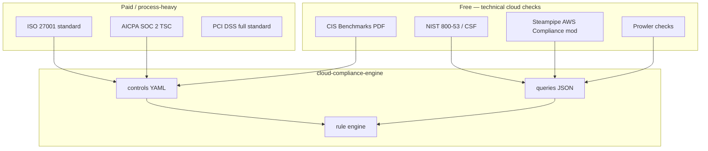

# Compliance Frameworks — Reference Library

Central place for **benchmark PDFs**, **framework metadata**, and **where to obtain** SOC 2, ISO 27001, NIST, PCI, and other policies.

Implementation (Steampipe queries, YAML controls, rule engine) lives in [`cloud-compliance-engine/`](../cloud-compliance-engine/). This folder is the **source-of-truth library** for human-readable benchmarks and acquisition links.

---

## Folder layout

```
compliance-frameworks/
├── catalog.yaml              # Inventory + implementation status (machine-readable)
├── README.md                 # This file
├── cis/                      # CIS Benchmarks (downloaded PDFs)
│   ├── aws/
│   │   ├── foundations/      # AWS account-wide (IAM, logging, networking)
│   │   ├── compute/          # EC2, Auto Scaling, etc.
│   │   ├── storage/          # S3, EBS, EFS, …
│   │   ├── database/         # RDS, DynamoDB, …
│   │   ├── eks/              # Kubernetes
│   │   ├── end-user-compute/ # WorkSpaces, AppStream, …
│   │   └── os/amazon-linux/  # OS-level (usually not Steampipe)
│   └── azure/
│       ├── foundations/
│       ├── storage/
│       └── database/
├── soc2/reference/           # Where to get SOC 2 criteria + technical mappings
├── iso27001/reference/
├── nist/reference/
├── pci-dss/reference/
├── hipaa/reference/
├── fedramp/reference/
└── mappings/                 # Cross-framework mapping notes
```

---

## What you have on disk (CIS)

| Framework | Provider | Version | PDF location | Engine status |
|-----------|----------|---------|--------------|---------------|
| AWS Foundations | aws | **v7.0.0** | `cis/aws/foundations/` | Reference only — code targets **v6** today |
| AWS Compute | aws | v1.1.0 | `cis/aws/compute/` | Reference only |
| AWS Storage | aws | v1.0.0 | `cis/aws/storage/` | Reference only |
| AWS Database | aws | v2.0.0 | `cis/aws/database/` | Reference only |
| AWS EKS | aws | v2.0.0 | `cis/aws/eks/` | Reference only |
| AWS End User Compute | aws | v1.2.0 | `cis/aws/end-user-compute/` | Reference only |
| Amazon Linux 2 | aws | v4.0.0 | `cis/aws/os/amazon-linux/` | Reference only (OS/agent checks) |
| Azure Foundations | azure | v6.0.0 | `cis/azure/foundations/` | Reference only |
| Azure Storage | azure | v1.0.0 | `cis/azure/storage/` | Reference only |
| Azure Database | azure | v2.0.0 | `cis/azure/database/` | Reference only |

**Implemented in code today:** `cis_aws_v6` only (~34 automated controls) — see [`cloud-compliance-engine/config/catalog.yaml`](../cloud-compliance-engine/config/catalog.yaml).

**Next implementation priority:** Finish CIS AWS Foundations v6/v7 → Azure Foundations v6 → service-specific CIS (storage, database) as needed.

---

## CIS — where to get more

| Resource | URL |
|----------|-----|
| All CIS Benchmarks (free PDF after signup) | https://www.cisecurity.org/cis-benchmarks |
| CIS AWS Foundations | Search “AWS Foundations” on CIS site |
| CIS Azure / GCP / Kubernetes | Same portal, filter by vendor |
| CIS Controls (top-level, not cloud-specific) | https://www.cisecurity.org/controls |

Download new PDFs into the matching folder under `cis/{provider}/{service}/`.

---

## SOC 2 — where to get it

SOC 2 is **not** a downloadable “cloud SQL benchmark” like CIS. It is **AICPA Trust Services Criteria** (organizational controls). Technical checks are usually **mapped** from CIS/NIST.

| Resource | What it is | URL |
|----------|------------|-----|
| **AICPA TSC** (official criteria) | CC6, CC7, etc. — audit language | https://www.aicpa.org/resources/landing/system-and-organization-controls-soc-2 |
| **AWS Audit Manager** | Prebuilt SOC 2 control sets for AWS | AWS Console → Audit Manager → standard frameworks |
| **Steampipe AWS Compliance mod** | SOC 2 benchmark with SQL controls | https://github.com/turbot/steampipe-mod-aws-compliance |
| **Prowler** | SOC 2 checks on AWS/Azure/GCP | https://github.com/prowler-cloud/prowler |
| **Vanta / Drata / Secureframe** | Commercial GRC with SOC 2 control libraries | Vendor docs (paid) |

**For this project:** Use Turbot’s SOC 2 mod or Prowler as the **technical control catalog**, then port queries into `cloud-compliance-engine/queries/`. Store the AICPA criteria PDF (if you obtain it) under `soc2/reference/`.

See [`soc2/reference/README.md`](soc2/reference/README.md).

---

## ISO 27001 — where to get it

| Resource | What it is | URL |
|----------|------------|-----|
| **ISO 27001:2022** (official) | Paid standard + Annex A controls | https://www.iso.org/standard/82875.html |
| **ISO 27002:2022** | Implementation guidance (paid) | https://www.iso.org/standard/75652.html |
| **AWS Compliance** | ISO 27001 mapping for AWS services | https://aws.amazon.com/compliance/iso-27001-faqs/ |
| **Microsoft Compliance** | ISO 27001 on Azure | https://learn.microsoft.com/en-us/azure/compliance/offerings/offering-iso-27001 |
| **CIS ↔ ISO mapping** | CIS Controls map to ISO 27001 | CIS documentation / CIS Controls v8 |
| **Steampipe mod** | ISO 27001 themed checks (via mod) | https://github.com/turbot/steampipe-mod-aws-compliance |

**For this project:** You rarely implement “ISO SQL” directly. Map **Annex A control themes** → existing CIS/NIST Steampipe queries. Many ISO checks are **policy/process** (manual), not API-scannable.

See [`iso27001/reference/README.md`](iso27001/reference/README.md).

---

## NIST — where to get it (free, best for technical mapping)

| Resource | Use case | URL |
|----------|----------|-----|
| **NIST Cybersecurity Framework 2.0** | Executive/risk language | https://www.nist.gov/cyberframework |
| **NIST SP 800-53 Rev 5** | Detailed security controls (FedRAMP base) | https://csrc.nist.gov/publications/detail/sp/800-53/rev-5/final |
| **NIST SP 800-171** | CUI / defense contractors | https://csrc.nist.gov/publications/detail/sp/800-171/rev-3/final |
| **AWS Config conformance packs** | NIST 800-53 rules as AWS Config rules | AWS Config → Conformance packs |
| **Steampipe mod** | `nist_800_53_rev_5` benchmark | https://github.com/turbot/steampipe-mod-aws-compliance |

NIST is the best **free** source for control IDs that map cleanly to cloud technical checks.

See [`nist/reference/README.md`](nist/reference/README.md).

---

## PCI DSS, HIPAA, FedRAMP

| Framework | Official source | Technical checks |
|-----------|-----------------|------------------|
| **PCI DSS 4.0** | https://www.pcisecuritystandards.org/ (registration) | Steampipe mod `pci_dss_v321`; Prowler PCI |
| **HIPAA Security Rule** | https://www.hhs.gov/hipaa/for-professionals/security/ | Steampipe mod HIPAA; many controls manual |
| **FedRAMP Moderate** | https://www.fedramp.gov/ (based on NIST 800-53) | NIST mappings + AWS GovCloud patterns |

Each has a `*/reference/README.md` under this folder with links and implementation notes.

---

## Recommended acquisition strategy



**Practical order for implementation:**

1. **CIS AWS Foundations** (v6 in code → migrate to v7) — you have the PDF
2. **Steampipe mod exports** — port SOC 2 / NIST / PCI queries from Turbot mod (see `docs/POWERPIPE_FOLDER_GUIDE.md`)
3. **CIS Azure Foundations** — you have PDF; add Azure Steampipe plugin queries
4. **ISO / SOC process controls** — catalog as `assessment_status: Manual` in YAML; automate only mappable subset
5. **Service-specific CIS** (storage, database, EKS) — after foundations complete

---

## How PDFs connect to the engine

| Layer | Location | Format |
|-------|----------|--------|
| Reference PDF | `compliance-frameworks/cis/...` | Human audit source |
| Control definitions | `cloud-compliance-engine/config/*_controls.yaml` | `control_id`, `severity`, `control_ref` |
| Steampipe queries | `cloud-compliance-engine/queries/*_queries.json` | SQL + `pass_rule` |
| Catalog registration | `cloud-compliance-engine/config/catalog.yaml` | Links framework_id → YAML + JSON |
| Seed to DB | `python -m app.scripts.seed_catalog` | Loads `compliance.controls` |

Adding a framework = PDF here (reference) + YAML + JSON in `cloud-compliance-engine` + catalog entry.

---

## Cross-framework mappings

See [`mappings/README.md`](mappings/README.md) for how CIS controls relate to SOC 2 CC series, ISO 27001 Annex A, and NIST 800-53.

---

## Git note

CIS PDFs are large. To keep the repo lean, add to `.gitignore`:

```
# compliance-frameworks/**/*.pdf
```

Keep PDFs locally or in shared storage; commit `catalog.yaml` and READMEs only.
